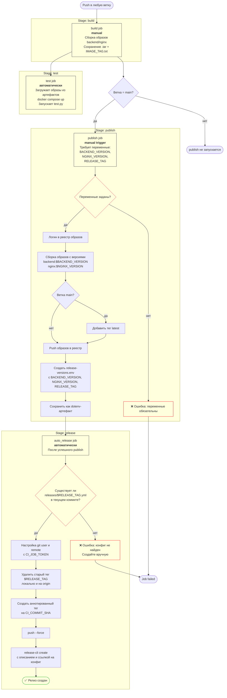

# ci-cd-demo

Демо полного цикла CI/CD простого веб-приложения (Python-backend + nginx)
на GitLab CI: сборка Docker-образов → тесты в docker:dind → публикация
версионных образов в реестр → деплой Ansible-плейбуками через
ansible-control-контейнер → авто-релиз.

## Пайплайн



## Структура

| Путь | Назначение |
| --- | --- |
| `.gitlab-ci.yml` | корневой оркестратор: ci-триггер (main/теги), cd-триггер (только теги) |
| `.gitlab-ci-ci.yml` | стадии build → test → publish → release |
| `.gitlab-ci-cd.yml` | стадия deploy: плейбуки через контейнер ansible-control |
| `backend/`, `nginx/` | Dockerfile + код приложения |
| `docker-compose.yml` | локальная связка nginx + backend |
| `playbooks/` | Ansible-плейбуки деплоя (backend / nginx / all) |
| `inventory/hosts.ini` | инвентарь: группы host'ов и параметры подключения |
| `releases/` | конфиги версий релизов `vX.Y.Z.yml` |
| `templates/` | reusable-компоненты CI (components) |
| `test.py` | проверки эндпоинта (все поля или точечно `--test <поле>`) |

## Переменные CI

`NEXUS_REGISTRY`, `NEXUS_USER`, `NEXUS_PASSWORD`, `GITLAB_TOKEN`;
при запуске publish вручную (Run with variables): `BACKEND_VERSION`,
`NGINX_VERSION`, `RELEASE_TAG`.

## Локальный запуск

```bash
docker compose up -d
python test.py
```

## Лицензия

MIT — см. [LICENSE](LICENSE).
